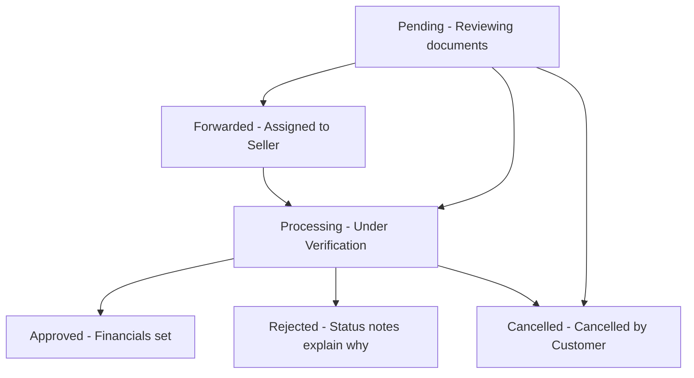

# Customer EMI Request API Integration Guide

This document outlines how the frontend team should integrate with the Customer EMI Request System. The backend provides a fully secure, JWT-authenticated API with file upload capabilities for submitting and managing EMI requests.

---

## 1. Authentication & Security Headers

All EMI Request endpoints require the customer to be logged in and the client request to be signed with the API key.

Include the following headers with **every** request:

| Header Name | Value / Format | Description |
| :--- | :--- | :--- |
| `Accept` | `application/json` | Ensures the response is returned as JSON. |
| `X-API-Key` | `YOUR_SECRET_API_KEY` | Mapped to `API_KEY` in the `.env` file. |
| `Authorization` | `Bearer JWT_TOKEN_HERE` | JWT Token received after verifying the customer's mobile OTP. |

---

## 2. API Endpoints Overview

| Method | Endpoint | Description | Auth Required | Request Format |
| :--- | :--- | :--- | :--- | :--- |
| **POST** | `/api/emi-requests` | Submit a new EMI request | Yes (JWT) | `multipart/form-data` |
| **GET** | `/api/emi-requests` | List current customer's EMI requests | Yes (JWT) | Query Params |
| **GET** | `/api/emi-requests/{id}` | Get status/details of a specific request | Yes (JWT) | None |
| **POST** | `/api/emi-requests/{id}/cancel`| Cancel a pending/processing request | Yes (JWT) | None |

---

## 3. Submit EMI Request (`POST /api/emi-requests`)

Used by the customer to apply for EMI on an active product.

> [!IMPORTANT]
> **File Storage & Upload Format:** Since frontend applications have no permanent storage, the API handles document storage entirely. You must send the request using **`multipart/form-data`** (not JSON) so the backend can process and save the uploaded image files (`aadhaar_card`, `pan_card`, `bank_passbook`) on the server.

### Request Body (multipart/form-data)

| Field Name | Type | Required | Validation Rules | Description |
| :--- | :--- | :--- | :--- | :--- |
| `product_id` | `Integer` | **Yes** | Must exist in the `products` table and be active | The ID of the product the customer wants to purchase on EMI. |
| `customer_name` | `String` | **Yes** | Max 255 characters | Full name of the applicant. |
| `customer_phone` | `String` | **Yes** | Exactly 10 digits | Mobile number of the customer. |
| `customer_address` | `String` | **Yes** | Max 1000 characters | Full shipping/billing address. |
| `customer_pincode`| `String` | **Yes** | Max 10 characters | Local postal PIN code. |
| `downpayment` | `Numeric` | **Yes** | Must be $\ge 0$ | Amount the customer is paying upfront. |
| `aadhaar_card` | `File` | **Yes** | Image format (`jpeg, jpg, png`), max 2MB | Upload of Aadhaar Card front/back. |
| `pan_card` | `File` | **Yes** | Image format (`jpeg, jpg, png`), max 2MB | Upload of PAN Card image. |
| `bank_passbook` | `File` | **Yes** | Image format (`jpeg, jpg, png`), max 2MB | Upload of bank passbook or cancelled cheque image. |

> [!WARNING]
> Do **NOT** send `tenure` (number of months) or `emi_amount` in this request. For customer submissions, these fields are restricted. They will be ignored by the API and are configured exclusively by the admin or assigned seller after reviewing the request.

### Success Response (`201 Created`)

```json
{
  "success": true,
  "message": "EMI request submitted successfully. Our team will review your application.",
  "data": {
    "id": 1,
    "customer_name": "John Doe",
    "customer_phone": "9999988888",
    "customer_address": "123 Test Lane, New Delhi",
    "customer_pincode": "110001",
    "aadhaar_card_url": "http://127.0.0.1:8000/storage/emi_documents/abc123aadhaar.png",
    "pan_card_url": "http://127.0.0.1:8000/storage/emi_documents/abc123pan.png",
    "bank_passbook_url": "http://127.0.0.1:8000/storage/emi_documents/abc123passbook.png",
    "downpayment": 2500.00,
    "status": "pending",
    "tenure": null,
    "emi_amount": null,
    "status_notes": null,
    "product": {
      "id": 15,
      "name": "Poco X6 Neo 5G",
      "sku": "POCO-X6-NEO",
      "price": 14999.00,
      "current_price": 13999.00,
      "image_url": "http://127.0.0.1:8000/storage/products/poco.jpg",
      "emi_available": true
    },
    "created_at": "2026-06-20T14:35:00.000000Z",
    "updated_at": "2026-06-20T14:35:00.000000Z"
  }
}
```

### Validation Error Response (`422 Unprocessable Entity`)

```json
{
  "success": false,
  "message": "Validation failed",
  "errors": {
    "customer_phone": [
      "The customer phone field must be 10 characters."
    ],
    "aadhaar_card": [
      "The aadhaar card field is required."
    ]
  }
}
```

---

## 4. Get EMI Request Status (`GET /api/emi-requests/{id}`)

Allows the frontend to retrieve the real-time status of a specific request (e.g., status updates, approved tenure, EMI amount, or reject reasons/notes).

### Success Response (`200 OK`)

```json
{
  "success": true,
  "message": "EMI request details retrieved successfully",
  "data": {
    "id": 1,
    "customer_name": "John Doe",
    "customer_phone": "9999988888",
    "customer_address": "123 Test Lane, New Delhi",
    "customer_pincode": "110001",
    "aadhaar_card_url": "http://127.0.0.1:8000/storage/emi_documents/abc123aadhaar.png",
    "pan_card_url": "http://127.0.0.1:8000/storage/emi_documents/abc123pan.png",
    "bank_passbook_url": "http://127.0.0.1:8000/storage/emi_documents/abc123passbook.png",
    "downpayment": 2500.00,
    "status": "approved",
    "tenure": 12,
    "emi_amount": 1050.00,
    "status_notes": "Aadhaar verified. EMI approved for 12 months.",
    "product": {
      "id": 15,
      "name": "Poco X6 Neo 5G",
      "sku": "POCO-X6-NEO",
      "price": 14999.00,
      "current_price": 13999.00,
      "image_url": "http://127.0.0.1:8000/storage/products/poco.jpg",
      "emi_available": true
    },
    "created_at": "2026-06-20T14:35:00.000000Z",
    "updated_at": "2026-06-20T15:10:00.000000Z"
  }
}
```

### Request Status Flow Diagram



---

## 5. List Customer's EMI Requests (`GET /api/emi-requests`)

Retrieve a paginated list of EMI requests submitted by the logged-in customer.

### Query Parameters

- `per_page` (optional): Number of records per page (default: `20`).
- `page` (optional): Page number (default: `1`).

### Success Response (`200 OK`)

```json
{
  "success": true,
  "message": "EMI requests retrieved successfully",
  "data": [
    {
      "id": 1,
      "customer_name": "John Doe",
      "status": "pending",
      "downpayment": 2500.00,
      "product": {
        "id": 15,
        "name": "Poco X6 Neo 5G",
        "sku": "POCO-X6-NEO",
        "price": 14999.00,
        "current_price": 13999.00,
        "image_url": "http://127.0.0.1:8000/storage/products/poco.jpg",
        "emi_available": true
      },
      "created_at": "2026-06-20T14:35:00.000000Z"
    }
  ],
  "meta": {
    "current_page": 1,
    "last_page": 1,
    "per_page": 20,
    "total": 1
  }
}
```

---

## 6. Cancel EMI Request (`POST /api/emi-requests/{id}/cancel`)

Allows the customer to cancel their request. Can only be done while the status is `pending` or `processing`.

### Success Response (`200 OK`)

```json
{
  "success": true,
  "message": "EMI request cancelled successfully",
  "data": {
    "id": 1,
    "status": "cancelled",
    "customer_name": "John Doe",
    "customer_phone": "9999988888",
    "customer_address": "123 Test Lane, New Delhi",
    "customer_pincode": "110001",
    "aadhaar_card_url": "http://127.0.0.1:8000/storage/emi_documents/abc123aadhaar.png",
    "pan_card_url": "http://127.0.0.1:8000/storage/emi_documents/abc123pan.png",
    "bank_passbook_url": "http://127.0.0.1:8000/storage/emi_documents/abc123passbook.png",
    "downpayment": 2500.00,
    "tenure": null,
    "emi_amount": null,
    "status_notes": null,
    "product": {
      "id": 15,
      "name": "Poco X6 Neo 5G",
      "sku": "POCO-X6-NEO",
      "price": 14999.00,
      "current_price": 13999.00,
      "image_url": "http://127.0.0.1:8000/storage/products/poco.jpg",
      "emi_available": true
    },
    "created_at": "2026-06-20T14:35:00.000000Z",
    "updated_at": "2026-06-20T14:35:00.000000Z"
  }
}
```

### Error Response (`400 Bad Request`)

If the request is already approved, rejected, or forwarded to a seller:

```json
{
  "success": false,
  "message": "Only pending or processing EMI requests can be cancelled. Current status: approved"
}
```

---

## 7. Product Details API Updates (`emi_available`)

To let the frontend know whether to display the "Apply for EMI" option/button on a product page, the standard Product Details API (`GET /api/products/{slug}`) response contains a boolean field `emi_available` on the root product object.

### Example Product Details Payload snippet:
```json
{
  "success": true,
  "data": {
    "id": 15,
    "name": "Poco X6 Neo 5G",
    "slug": "poco-x6-neo-5g",
    "price": 13999.00,
    "emi_available": true,
    "is_active": true,
    "is_on_flash_sale": false,
    "created_at": "2026-06-20T14:35:00.000000Z",
    "updated_at": "2026-06-20T14:35:00.000000Z"
  }
}
```

If `emi_available` is `false`, the frontend must disable or hide any "Apply for EMI" buttons/actions on the product details page.
